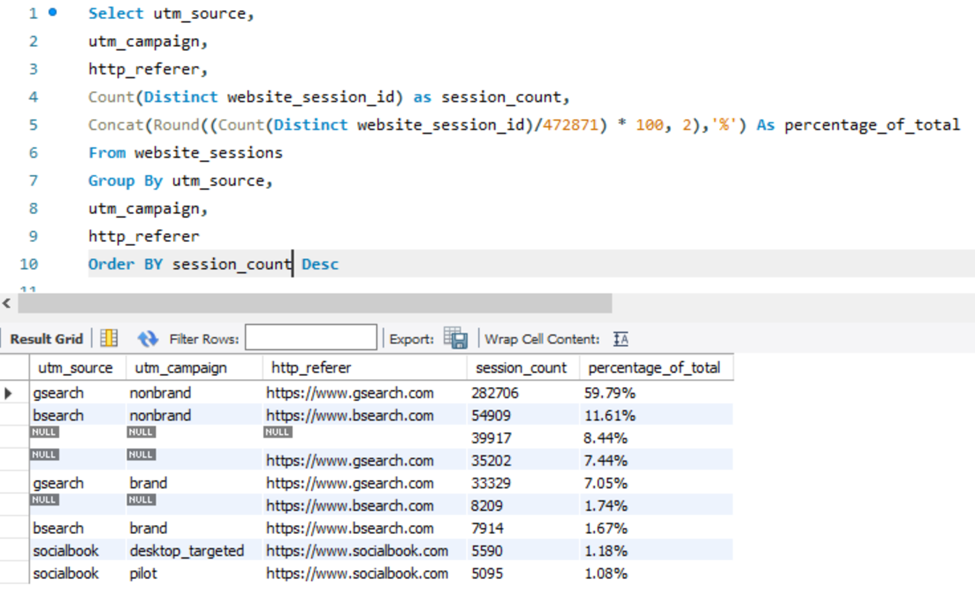

# MavenFuzzyFactory: E-commerce online retail analysis using SQL
## Background
Maven Fuzzy Factory is a newly launched frictional eCommerce retail startup that sells stuffed animals. The company was started on march 2012 and has been in operation for 3 years now.  
## There Are Key Concepts To Be Covered:

1. Traffic Analysis & Optimization: Dive into the intricacies of understanding and optimizing web traffic.  
2. Website Measurement & Testing: Explore methods to measure website performance and conduct effective testing.  
3. Channel Analysis & Optimization: Delve into strategies for analyzing and optimizing marketing channels.  
4. Product-Level Analysis: Uncover insights by analyzing data at the product level.  
5. User-Level Analysis: Understand user behavior through in-depth analysis.

## Skills To Be Used Throughout The Project:

1. Write advanced SQL queries that unleash the full potential of your Maven Fuzzy Factory database within MySQL Workbench.  
2. Tackle complex, multi-step data problems using subqueries and temporary tables.  
3. Solve practical hands-on assignments and real-world e-commerce use cases to solidify your skills.  
4. Analyze data across multiple tables with the efficiency of powerful MySQL JOIN statements.  

## Project Structure:

1. Project1.sql & Project2.sql: 2 projects to solve database queries.  
2. Tables Structure Explained.md: Explain in detail how each table is represented and linked to each other.  
3. Create_mavenfuzzyfactory.sql: Tables structure and data.  

## 1.Traffic Sources Analysis
Tables Used: website_sessions, orders  

Traffic source analysis refers to the process of evaluating and understanding the different channels or sources driving visitors to a website. It involves analyzing and categorizing where website traffic is coming from to determine which marketing efforts or platforms are contributing most to the influx of visitors. The goal of traffic source analysis is to identify and assess the effectiveness of various marketing channels and campaigns in driving website traffic. This analysis helps businesses make informed decisions about their marketing strategies, budget allocation, and audience targeting. In this section, we aim to address the following two questions.  
### 1.1  What is the primary source of website traffic?

## 2. Website Performance Analysis  

## 3. Conversion Funnel Analysis    

## 4. Channel Portfolio Management 

