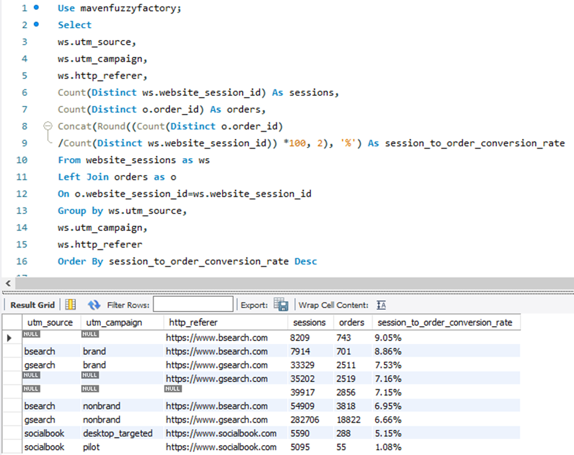
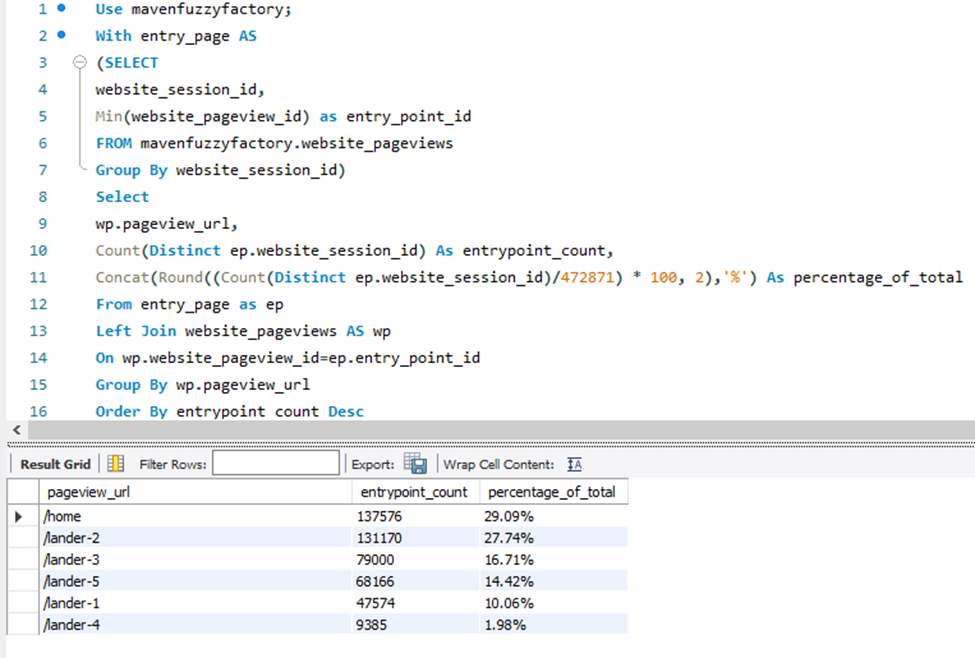
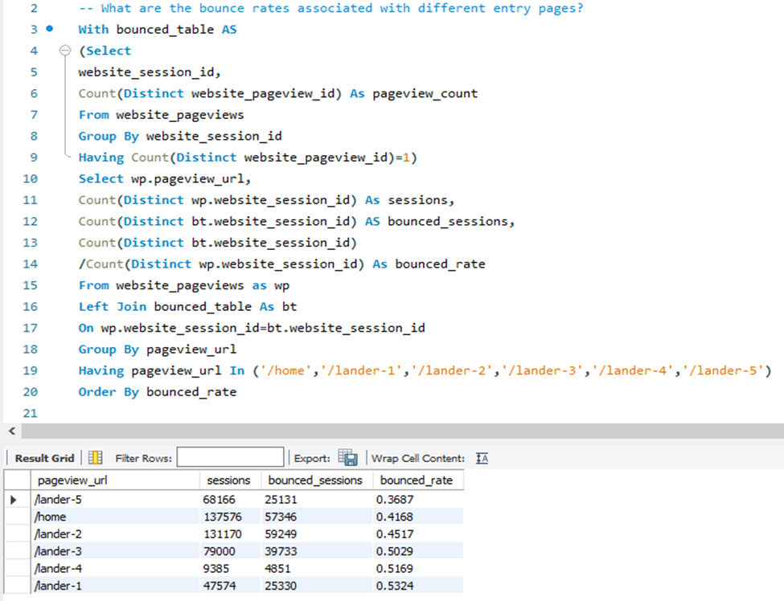
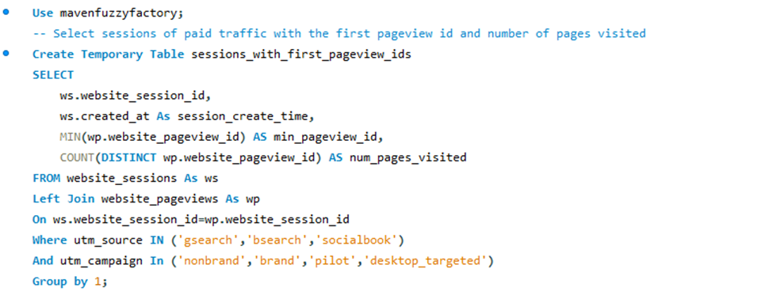
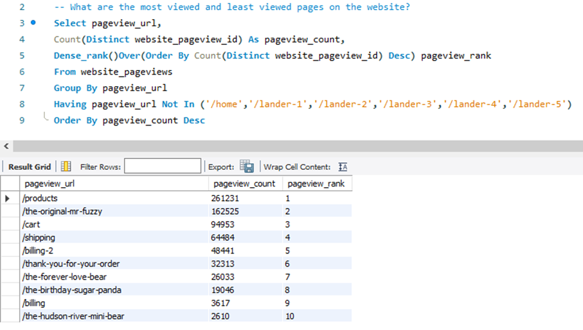
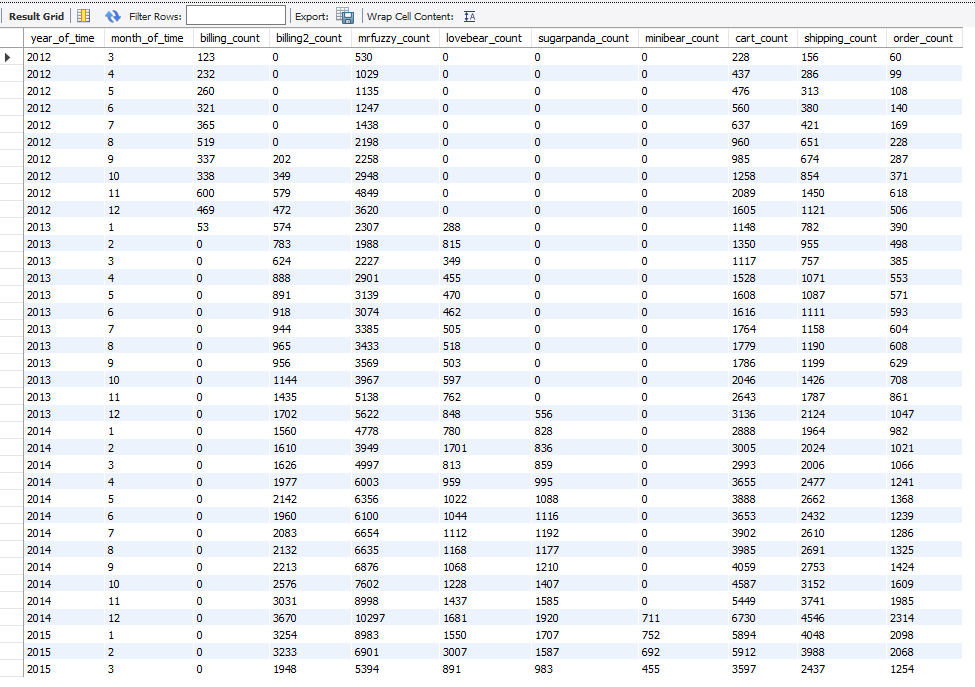
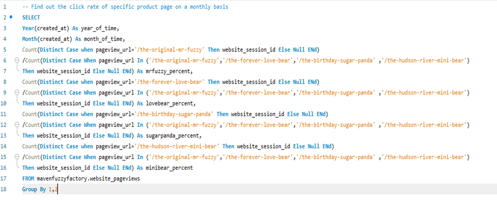
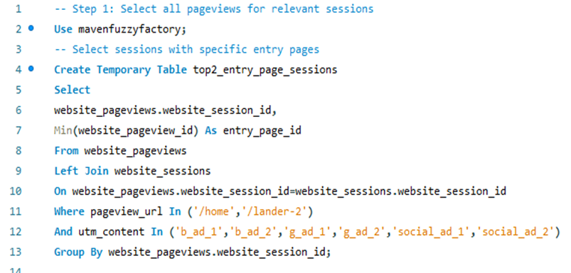

# MavenFuzzyFactory: E-commerce online retail analysis using SQL
## Background
Maven Fuzzy Factory is a newly launched frictional eCommerce retail startup that sells stuffed animals. The company was started on march 2012 and has been in operation for 3 years now.  
## There Are Key Concepts To Be Covered:

1. Traffic Analysis & Optimization: Dive into the intricacies of understanding and optimizing web traffic.  
2. Website Measurement & Testing: Explore methods to measure website performance and conduct effective testing.  
3. Channel Analysis & Optimization: Delve into strategies for analyzing and optimizing marketing channels.  
4. Product-Level Analysis: Uncover insights by analyzing data at the product level.  
5. User-Level Analysis: Understand user behavior through in-depth analysis.

## Skills To Be Used Throughout The Project:

1. Write advanced SQL queries that unleash the full potential of your Maven Fuzzy Factory database within MySQL Workbench.  
2. Tackle complex, multi-step data problems using subqueries and temporary tables.  
3. Solve practical hands-on assignments and real-world e-commerce use cases to solidify your skills.  
4. Analyze data across multiple tables with the efficiency of powerful MySQL JOIN statements.  

## Project Structure:

1. Project1.sql & Project2.sql: 2 projects to solve database queries.  
2. Tables Structure Explained.md: Explain in detail how each table is represented and linked to each other.  
3. Create_mavenfuzzyfactory.sql: Tables structure and data.  

## 1.Traffic Sources Analysis
Tables Used: website_sessions, orders  

Traffic source analysis refers to the process of evaluating and understanding the different channels or sources driving visitors to a website. It involves analyzing and categorizing where website traffic is coming from to determine which marketing efforts or platforms are contributing most to the influx of visitors. The goal of traffic source analysis is to identify and assess the effectiveness of various marketing channels and campaigns in driving website traffic. This analysis helps businesses make informed decisions about their marketing strategies, budget allocation, and audience targeting. In this section, we aim to address the following two questions.  
### 1.1  What is the primary source of website traffic?

The leading three sources of primary traffic are Gsearch Nonbrand, Bsearch Nonbrand, and direct type-in. According to the results, Gsearch Nonbrand generates the most website sessions, making up 59.79% of the overall sessions. Bsearch Nonbrand follows in second place, contributing 11.61% of the total sessions. Direct type-in comes in third, accounting for 8.44% of the sessions.  

### 1.2 How do different traffic channels perform in terms of conversion rates?  

From the results above, it is clear that five channels have conversion rates exceeding 7%. These channels are organic search, Bsearch Brand, Gsearch Brand, and direct type-in. Despite Gsearch Nonbrand and Bsearch Nonbrand being the main sources of traffic, their conversion rates are around 6.5%. Unfortunately, the socialbook channels underperform in both the desktop-focused campaign and pilot, with conversion rates of 5.15% and 1.08%, respectively.   

## 2. Website Performance Analysis  

Website performance refers to how effectively a website delivers its content and functionality to users. Analyzing website performance involves tracking and evaluating key performance indicators (KPIs), such as:  

- **Conversion rates**: The proportion of visitors who complete specific actions, like making a purchase or placing an order.  
- **Bounce rate**: The percentage of users who leave the site after viewing only one page.  
- **User engagement**: Metrics that measure user interaction on the site, including page views and click-through rates.  

The primary goal of assessing website performance is to identify bottlenecks, enhance the user experience, boost conversions, and optimize the website’s overall functionality. In this section, we aim to address the following questions:  

### 2.1 What are the top entry pages?  

Based on the results, it is evident that the top two landing pages are "/home" and "/lander-2," which account for 29.09% and 27.74% respectively. Collectively, these two landing pages represent more than half of the total traffic.  

### 2.2 What are the bounce rates associated with different entry pages?  

From the results mentioned above, it’s clear that the entry page '-lander-5' has the lowest bounce rate at 0.3687. Next, the '/home' entry page shows a slightly higher bounce rate of 0.4168, followed by '/lander-2' with a bounce rate of 0.4517. In contrast, the other three entry pages all have bounce rates above 0.5, which can be regarded as relatively high.  

### 2.3 What are the overall paid traffic bounce rate trend monthly of different entry page?  

The results indicate a significant reduction in the overall bounce rate for paid traffic, dropping from 0.6079 to the most recent figure of 0.4023. The lowest bounce rate was recorded in February 2015 at 0.3957. Additionally, the data reveals entry and exit times for each landing page, showing that some pages overlapped in their operational periods. Notably, the "/home" and "/lander2" pages had the longest durations of 36 and 24 months, respectively. Conversely, "/lander1" and "/lander4" had bounce rates exceeding 0.5, leading to their discontinuation. Apart from "/home," both "/lander3" and "/lander5" are still active, while the other pages have been retired. It is also worth mentioning that "/lander2" outperformed "/lander3" from July 2013 to October 2014, but after a downturn in performance starting in November 2014, "/lander2" was eventually decommissioned.  

### 2.4 What are the most viewed and least viewed pages on the website? List the ranking of them.  

By pulling out the “pageview_url” of a complete session, we know that the sequence of placing an order is :

Page 1: entry pages which are '/home','/lander-1','/lander-2','/lander-3','/lander-4','/lander-5'

Page 2:'/products',

Page 3:'/the-original-mr-fuzzy'('/the-hudson-river-mini-bear','/the-birthday-sugar-panda','/the-forever-love-bear'),

Page 4:'/cart',

Page 5:'/shipping',

Page 6:'/billing-2'('/billing')(‘/billing’ was withdrawn in January 2013.)

Page 7:'/thank-you-for-your-order'

In our analysis, we began by excluding the landing pages' URLs. It is evident that the "/products" pageview holds the top position. Following the product page, we identified four specific product pages. Among them, the "/the-original-mr-fuzzy" page emerged as the most popular, accumulating 162,525 views. However, the remaining three product pages received significantly less attention, with the "the-hudson-river-mini-bear" page having the lowest views at only 2,610. We need to investigate the underlying reasons for the low view count of this particular page.  

Based on the results, it’s clear that the "/the-original-mr-fuzzy" product page has been maintained for the longest time compared to the other product pages. Next, we have the pages for "/the-forever-love-bear," "/the-birthday-sugar-panda," and "/the-hudson-river-mini-bear," which were introduced as new products in 2013, 2014, and 2015, respectively. Notably, the "/the-hudson-river-mini-bear" page has received the fewest views among these four. The variation in release dates suggests the need for a closer examination of their performance. Therefore, we analyzed the click-through rates of these four product pages on a monthly basis, using SQL codes to generate the results.  

From the results, it's clear that the click-through rate for "/the-original-mr-fuzzy" has remained consistently stable over time. In contrast, the "/the-hudson-river-mini-bear" page consistently shows the lowest click-through rate. This isn't surprising given that it's the newest page and product among the four. Notably, while the other two products achieved click-through rates above 0.1 within the first month of release, "/the-hudson-river-mini-bear" took four months to reach a rate of around 0.05.  

Additionally, a seasonal pattern has been identified in the click-through rate for "/the-forever-love-bear." February stands out as the month with the highest click-through rate, nearly 0.3, which aligns with expectations due to the increased interest around Valentine's Day.  

## 3. Conversion Funnel Analysis    

Conversion funnel analysis is a technique used to evaluate how website visitors or users progress through the different stages of a conversion process. The conversion funnel outlines the series of steps users take, beginning with awareness or discovery and leading to a desired action or conversion, such as making a purchase or placing an order. Through conversion funnel analysis, businesses can better understand user behavior, identify where users may drop off, and improve the overall conversion process. In this section, our goal is to complete the following task:

- Build a conversion funnel to evaluate the conversion rates of the top two entry pages (‘/home’ and ‘/lander-2’) for paid traffic.

### 3.1 Can the paid traffic conversion funnels be established to evaluate the conversion rates of the top 2 entry pages?  

We solve this problem following the following steps: Step 1: Select all pageviews for relevant sessions. Step 2: Identify the sequence of placing an order. Step 3: Build the conversion funnel.  

#### 3.1.1 Select all pageviews for relevant sessions  

#### 3.1.2 Identify the sequence of placing an order  

#### 3.1.3 Build the conversion funnel  

## 4. Channel Portfolio Management 

